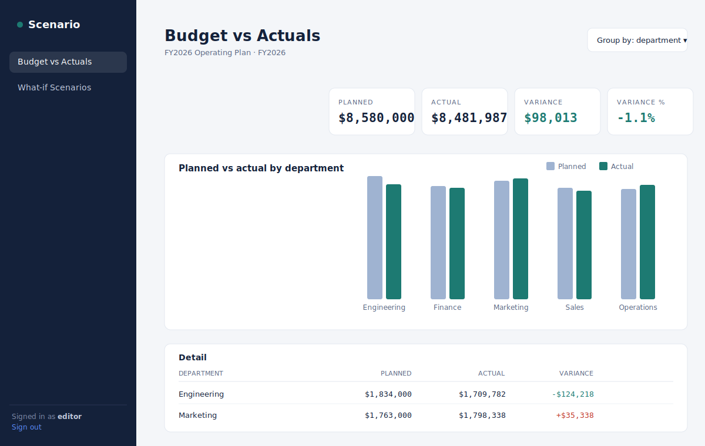

# Scenario — FP&A Budgeting & What-if Modelling

A full-stack internal finance tool: load an operating budget, compare **budget vs
actuals**, and run **what-if scenarios** by layering adjustable "levers" on top of
the base plan. Built as a portfolio project that mirrors the kind of internal
business application a corporate engineering team ships.

> **Read this first.** This is a reference implementation to *learn from and
> extend*. Run it, read every file, then make it yours — add a feature, change
> the data model, deploy it — before you put it on a resume. An interviewer will
> ask you to defend your architecture; you can only do that if it's genuinely yours.

## Preview



*Representative UI preview generated from the app's real layout and the actual numbers produced by its seed data / load test. To capture live screenshots, run the app (see Quickstart) and replace `docs/preview.png`.*


---

## Features

- **Budget vs actuals** with variance ($ and %) grouped by department, category, or region.
- **What-if scenarios**: create named scenarios and stack levers (e.g. "+15% cloud",
  "-10% on all travel", "flat +5k to APAC") to project a new plan and compare it to the base.
- **Role-based access control**: `viewer` (read-only), `editor`, `admin`. Write
  endpoints are gated by role; the UI hides edit controls for viewers.
- **JWT auth** with a clean login flow.
- **REST API** with auto-generated OpenAPI docs at `/docs`.
- **Tested**: a pytest suite covering both the pure computation engine and the API/RBAC.

## Architecture

```
React (Vite) ──HTTP/JSON──> FastAPI ──> SQLAlchemy ORM ──> SQLite / Postgres
   │                          │
   │ recharts, axios          ├── auth.py        JWT issue/verify + role gating
   │ react-router             ├── engine.py      pure FP&A math (levers, variance)
   └ token in localStorage    └── routers/       auth · budgets · scenarios
```

The **computation core** (`engine.py`) is deliberately free of FastAPI and database
types — it's plain functions over dicts, so it's trivially unit-testable and reusable.

## Tech stack

| Layer     | Tech |
|-----------|------|
| Frontend  | React 18, Vite, React Router, Recharts, Axios |
| Backend   | FastAPI, SQLAlchemy 2.0, Pydantic v2, PyJWT |
| Database  | SQLite by default; Postgres via `DATABASE_URL` |
| Tests     | pytest + FastAPI TestClient |

---

## Quickstart

### 1. Backend
```bash
cd backend
python -m venv .venv && source .venv/bin/activate      # Windows: .venv\Scripts\activate
pip install -r requirements.txt
python -m app.seed          # creates scenario.db with demo users + FY2026 budget
uvicorn app.main:app --reload   # http://localhost:8000  (docs at /docs)
```

### 2. Frontend
```bash
cd frontend
npm install
npm run dev                 # http://localhost:5173  (proxies /api -> :8000)
```

Open http://localhost:5173 and sign in:

| Username | Password | Role   |
|----------|----------|--------|
| admin    | admin    | admin  |
| analyst  | analyst  | editor |
| viewer   | viewer   | viewer |

### Run the tests
```bash
cd backend && pytest -q
```

---

## API overview

| Method | Endpoint | Role | Purpose |
|--------|----------|------|---------|
| POST | `/api/auth/login` | — | Get a JWT |
| GET  | `/api/budgets` | viewer | List budgets |
| POST | `/api/budgets` | editor | Create a budget |
| GET  | `/api/budgets/{id}/variance?group_by=` | viewer | Budget vs actuals |
| POST | `/api/budgets/{id}/scenarios` | editor | Create a scenario |
| POST | `/api/scenarios/{id}/levers` | editor | Add a what-if lever |
| GET  | `/api/scenarios/{id}/compare?group_by=` | viewer | Base vs scenario projection |

## Project structure
```
backend/
  app/
    main.py        app wiring + CORS
    database.py    engine/session (SQLite or Postgres)
    models.py      ORM: Budget, BudgetLine, Actual, Scenario, Lever, User
    schemas.py     Pydantic request/response contracts
    engine.py      pure FP&A computation (apply_levers, variance, compare)
    auth.py        password hashing, JWT, role-gating dependency
    routers/       auth · budgets · scenarios
    seed.py        demo data
  tests/test_api.py
frontend/
  src/
    api.jsx        axios instance + auth context + formatters
    App.jsx        routes + protected shell
    pages/         Login, Dashboard, Scenarios
```

---

## How this maps to the job (and your resume)

This project was built against a Google **Application Engineer, Full Stack** posting.
It demonstrably hits:

- *Internal applications related to financial planning and analysis* → the whole app.
- *Designing and integrating internal applications* → REST API + React client + auth.
- *Programming in Python* → FastAPI backend.
- *Full SDLC: design, build, test* → models → API → UI, with a test suite.

**Sample resume bullets** (use only the parts that are true once you've extended it):
- *Built a full-stack FP&A web app (React, FastAPI, SQLAlchemy) with JWT auth and
  role-based access, supporting budget-vs-actuals variance and what-if scenario modelling.*
- *Designed a pure, unit-tested computation engine for scenario projection and variance,
  separated from the web/DB layer; covered with a pytest suite (engine + API + RBAC).*

## Make it yours (extension ideas)
1. Add **month-by-month actuals** and a time-series trend line.
2. Add **scenario versioning / clone-and-edit** and a "promote scenario to budget" action.
3. Swap SQLite for **Postgres** (set `DATABASE_URL`) and add a `docker-compose.yml`.
4. Add a **CSV import** endpoint for budget lines (the JD's "third-party integration").
5. Deploy to **Google Cloud Run** + Cloud SQL and add a CI workflow.

## Interview prep — questions to be ready for
- Why separate `engine.py` from the routers? (testability, reuse, single responsibility)
- How does role-based access work end-to-end, from JWT to the `require_role` dependency?
- How would levers compose if two match the same line? (they compound, in order — see `apply_levers`)
- Where would this break at scale, and what would you change? (N+1 queries, in-Python aggregation → push to SQL/`GROUP BY`, caching, pagination)

## Notes / limitations
- Password hashing uses salted SHA-256 for a dependency-light demo. **Use bcrypt/argon2
  in production** and store `SECRET_KEY` in a managed secret store.
- Variance/compare aggregate in Python for clarity; at real scale, push aggregation
  into SQL. This is called out deliberately as a known trade-off.
